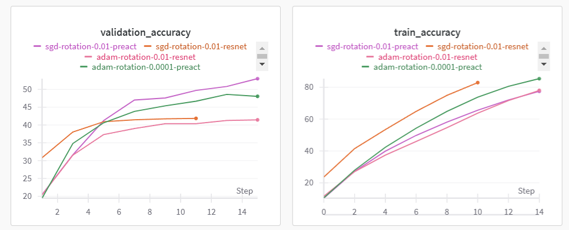

## Hyperparameter Sweep Details
The following parameters are sweeped during training: 
- **Model architecture**: ResNet18, PreAct ResNet18, LeNet and MLP, 
- **Optimizer**: Adam and SGD with Nesterov momentum.
- **Learning rate**: Values in [0.01, 0.0001], 
- **Data augmentations**: Rotation or Jitter.

## Configuration and Test Accuracy Results
The following table presents the test accuracy results for selected configurations:

| Model             | Optimizer  | Learning Rate | Augmentations Applied | Test Accuracy |
|-------------------|------------|---------------|-----------------------|---------------|
| preact_resnet18   | Adam       | 0.0001        | Rotation              | 48.59%        |
| resnet18_cifar10  | Adam       | 0.01          | Rotation              | 41.44%        |
| resnet18_cifar10  | SGD        | 0.01          | Rotation              | 41.85%        |
| preact_resnet18   | SGD        | 0.01          | Rotatiom              | 53.01%        |

## Wandb metrics

## Training Pipeline Efficiency
The training pipeline is optimized in the following ways:
1. **Use of Concatenated Datasets**: Augmentation transformations are done at the start and the result is concatenated with the initial dataset as opposed to applying augmentation during training

2. **Early Stopping**: Early stopping was used to prevent overfitting by halting training when validation loss stops improving

---

Evaluation
Based on the lack of good performance, i expect to receive 16 points.

